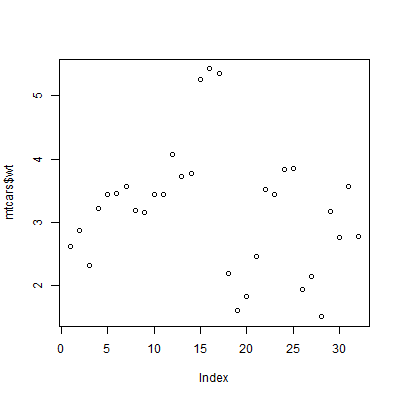
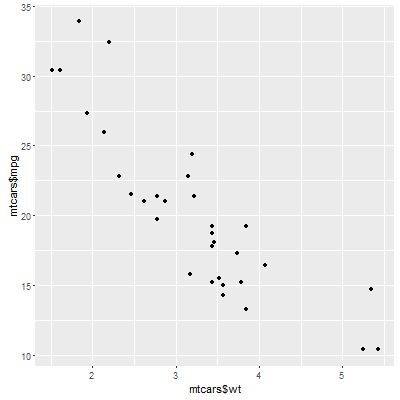
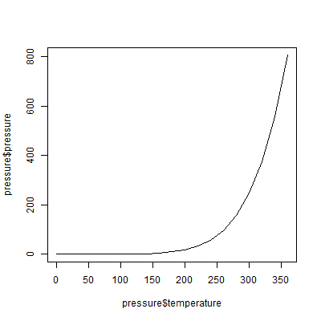
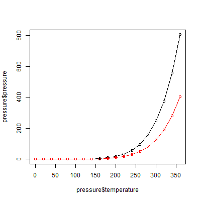
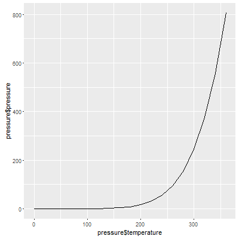
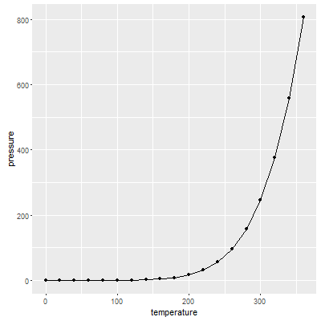

# RTestDemo
R是一种为统计计算和绘图而生的语言和环境.是 一套开源的数据分析解决方案.

##NVim-R
开始：\rf #打开了一个RConsole  
结束: \rq #关闭但不保存RConsole  
\l #发送当前行的命令去RConsole  
\ro #打开对象浏览窗口  
C+X+O #代码补全  

##[DemoOne](DemoOne/DemoOne.r)(加载分隔符式文本文件即csv文件)
T = TRUE  
F = FALSE  
Shift+- = <-  
as.vector() 向量转为字符型  
as.numeric() 向量转为数字  

##[DemoTwo](DemoTwo/DemoTwo.r)(从Excel文件、SPSS文件中加载数据)
* [SPSS](http://baike.baidu.com/link?url=ibkj5Z1IrwqfdrNXF1hmH_AfMps04RvxkRQvArY2-w0SLeLAyRiD2vh7_6hO4BMb2mK7U5AEaKR1_dmlBdc6k_):为一个统计软件，生成的文件以扩展名为.sav

##[DemoThree常见图形的绘制](DemoThree/DemoThree.r)
**图1.1**  
  
**图1.2**  
  
**图2.1**  
  
**图2.2**  
  
**图2.3**  
  
**图2.4**  
  
